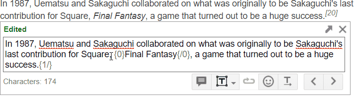
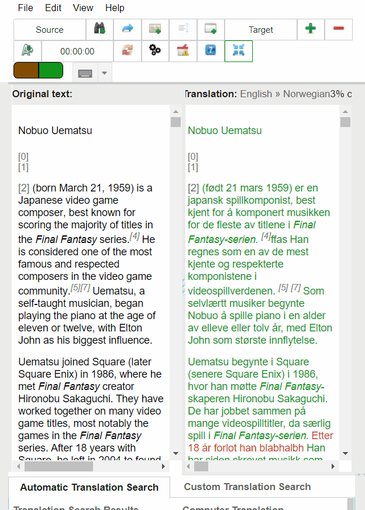
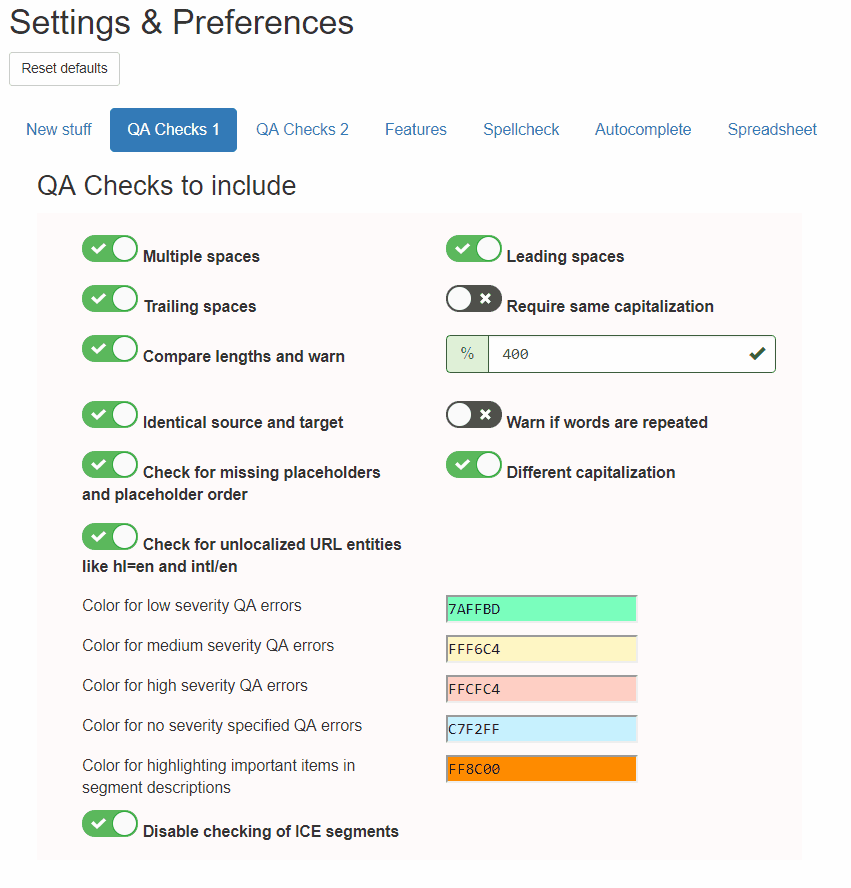

### GTT Booster

GTT Booster is an Open Source Chrome Extension for Google Translator Toolkit. It was developed with space-based languages in mind, but you may have some luck using it for scriptio continua languages like Chinese or Hindi.

GTT Booster is freely available under the GPL 3.0 or later. You may [download and use the extension from the Chrome web store](https://chrome.google.com/webstore/detail/google-translator-toolkit/pjankaakojbendjaejlcnpgeldmfpjed) for any private or commercial purpose.

### Bug fixes and reports

Please file an issue on Github, or e-mail me at [gttbooster@gmail.com](gttbooster@gmail.com)

### Top features

#### Typing autocompletion :fast_forward:
leverages MT, TM and glossary matches

#### Merged view

#### Configure everything!

### Other features:
#### Customizable QA-checking, with all the standard checks built-in
#### Resize document fonts easily
#### More below!

