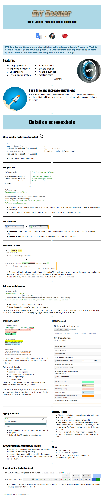

### GTT Booster

GTT Booster is an Open Source Chrome Extension for Google Translator Toolkit.
Its intended user is a professional translator working for Google. This tool is NOT intended for a general audience in its current state.

Core functionality may be lacking if you are using this on a non-Google account!

GTT Booster is freely available under the GPL 3.0 or later. You may [download and use the extension from the Chrome web store](https://chrome.google.com/webstore/detail/google-translator-toolkit/pjankaakojbendjaejlcnpgeldmfpjed) for any private or commercial purpose.

TIP: Type `localStorage['cth-dev-mode'] = true` in the browser console, and you will get some development features that you may find useful ;) I just haven't gotten around to publishing them yet.

### Bug fixes and reports

Please file an issue on Github, or e-mail me at [gttbooster@gmail.com](gttbooster@gmail.com)

### Top features

#### Typing autocompletion :fast_forward:
leverages MT, TM and glossary matches

#### Merged view :page_with_curl:

#### Configure everything! :surfer:

